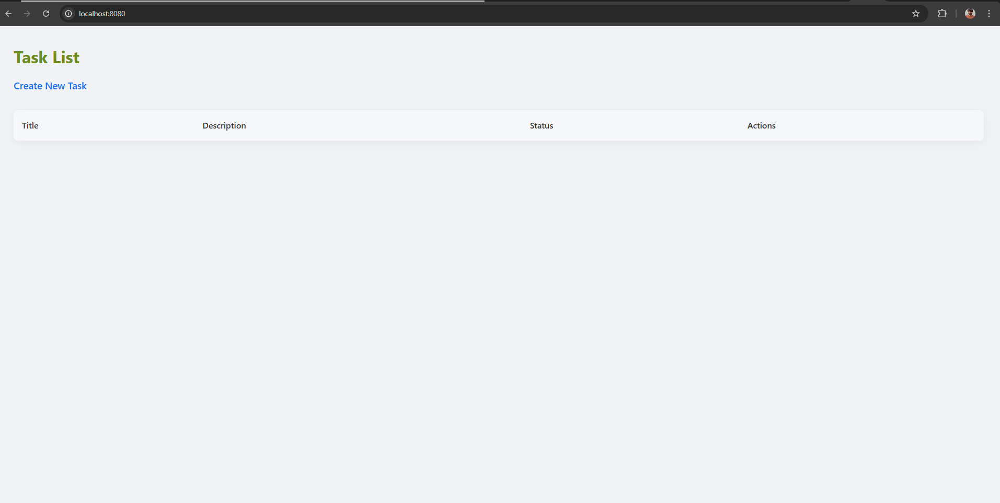
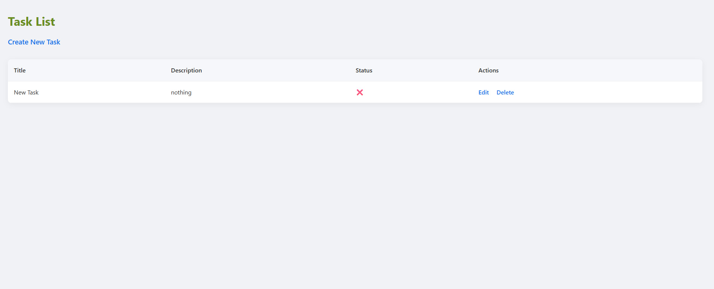
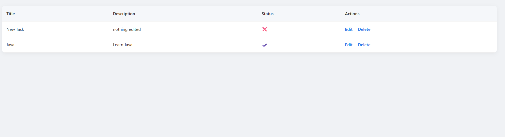

# 📝 TaskManager With Java

A simple and elegant task management web application built with **Java**, **Spring Boot**, **Thymeleaf**, and **Maven**. This app allows users to create, update, delete, and view tasks with a clean UI and persistent data storage.

## 🌟 Features

- ✅ Create, read, update, delete (CRUD) operations for tasks  
- 📄 Each task has a title, description, and status (completed/incomplete)  
- 🧼 Clean and responsive UI using HTML/CSS (with Tailwind styling or similar)  
- 🗃️ Task persistence via a relational database (e.g., H2/MySQL)  
- 🚀 Built and managed using Maven  
- ☕ Java 17 + Spring Boot backend

## 📸 Screenshots

### 🔍 Empty Task List View


---

### 🆕 Adding a Task


---

### 📋 Populated Task List


---

### 🖊️ Edit Task


---

### ✅ Completed Task Status View


---

## 🛠️ Tech Stack

| Layer        | Technology             |
|--------------|-------------------------|
| Backend      | Java 17, Spring Boot    |
| Frontend     | Thymeleaf, HTML, CSS    |
| Build Tool   | Maven                   |
| DB (optional)| H2 / MySQL              |
| Deployment   | Localhost (Tomcat 8080) |

## 🚀 Getting Started

### Prerequisites
- Java 17+
- Maven 3.6+
- IDE (e.g. IntelliJ IDEA, Eclipse)

### Run Locally

```bash
# Clone the repository
git clone https://github.com/shafeenyousafzaii/TaskManager-With-Java.git
cd TaskManager-With-Java

# Build the project
mvn clean install

# Run the application
mvn spring-boot:run
